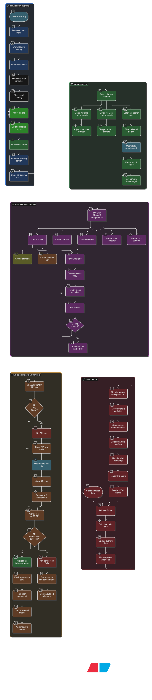

# **Solar System Explorer**

A high-fidelity, interactive 3D simulation of our solar system built with Three.js. This project renders planets, moons, spacecraft, and comets with real-time and simulated orbital mechanics, inspired by NASA's "Eyes on the Solar System."

## **About The Project**

This web application provides an interactive 3D visualization of the solar system. It leverages Three.js for WebGL rendering to create an immersive experience. Users can explore planets, track spacecraft, and control the flow of time to watch orbital patterns. The UI is heavily inspired by NASA's jet propulsion laboratory (JPL) aesthetic, providing a clean, data-driven interface for interaction.

The simulation can run in two modes:

1. **Simulation Mode:** Control the speed of time, from 'Paused' up to '100 Years/sec', to observe long-term orbital dynamics.  
2. **Live Mode:** (Requires NASA API) Aims to sync with real-world time and data to show the current state of the solar system.

## **Key Features**

* **3D Solar System:** Renders the Sun, all major planets, and their primary moons.  
* **Time Control:** A full-service time panel to pause, play, and accelerate time from 1 day/sec to 100 years/sec.  
* **Real-Time & Simulated Orbits:** Calculates and displays elliptical orbital paths. Planet positions are updated based on orbital period and eccentricity.  
* **Spacecraft Tracking:** Loads 3D GLTF models for famous spacecraft (e.g., Voyager, ISS, Hubble, James Webb) and places them in their correct orbits.  
* **Procedural Generation:**  
  * **Asteroid Belt:** A THREE.Points based, procedurally generated asteroid belt between Mars and Jupiter.  
  * **Planetary Rings:** Particle-based, procedural rings for Saturn, Jupiter, Uranus, and Neptune.  
  * **Comets:** Generates comets with a nucleus, coma, and a tail that realistically points away from the Sun.  
* **NASA API Integration:** Prompts for a NASA API key to (in future) fetch live data. Currently, it validates the key and simulates live positions.  
* **Interactive UI:**  
  * **Search:** Find any object (planet, moon, spacecraft) by name.  
  * **Focus View:** Double-click or search to smoothly animate and lock the camera onto any object.  
  * **Visibility Toggles:** Selectively hide/show planets, moons, spacecraft, orbits, and labels.  
* **Optimized Labeling:** Renders 2D HTML labels that automatically de-cluster (hide overlapping labels) to maintain a clean view.  
* **Loading Screen:** A polished loading overlay with a solar-system animation and a progress bar that tracks loaded assets.

## **Built With**

* [Three.js](https://threejs.org/) \- The core 3D WebGL library.  
* [JavaScript (ES6+ Modules)](https://developer.mozilla.org/en-US/docs/Web/JavaScript/Guide/Modules) \- For the main application logic.  
* [HTML5](https://developer.mozilla.org/en-US/docs/Web/Guide/HTML/HTML5) \- For structure and the UI overlay.  
* [CSS3](https://developer.mozilla.org/en-US/docs/Web/CSS) \- For the complete NASA-inspired styling.

## **File Structure**

Your code implies the following file structure. You must create the textures/ and models/ directories and populate them with the necessary assets for the application to run.

/solar-system-explorer  
│  
├── index.html  
├── main.js  
│  
├── textures/  
│   ├── sun.png  
│   ├── mercury.jpg  
│   ├── venus.jpg  
│   ├── earth.jpg  
│   ├── mars.jpg  
│   ├── jupiter.jpg  
│   ├── saturn.jpg  
│   ├── uranus.jpg  
│   ├── neptune.jpg  
│   ├── blue\_marble.png  
│   └── blue\_marble.jpg  
│  
└── models/  
    ├── OSIRIS-REx.glb  
    ├── Parker Solar Probe.glb  
    ├── New\_Horizons.glb  
    ├── Voyager Probe (A).glb  
    ├── Voyager Probe (B).glb  
    ├── James Webb Space Telescope (B).glb  
    ├── Hubble Space Telescope (A).glb  
    ├── International Space Station (ISS) (A).glb  
    └── Gateway Core.glb

## **Getting Started**

To run this project locally, you **must** use a local web server. Opening index.html directly from the filesystem (file:///...) will **not** work due to browser security policies (CORS) related to ES6 modules, fetch, and loading external assets.

### **Prerequisites**

* A modern web browser (Chrome, Firefox, Safari, Edge).  
* A local web server. The easiest way is using [Node.js](https://nodejs.org/) and the npx command.  
* (Optional but Recommended) A NASA API Key.

### **Installation & Setup**

1. **Download Files:** Place index.html and main.js in a new project folder.  
2. **Create Asset Folders:** Inside your project folder, create two new folders:  
   * textures/  
   * models/  
3. **Add Assets:** (This is the critical step) You must find and add all the texture images and .glb 3D models listed in the [File Structure](#bookmark=id.pink0jywloql) section. The names must match *exactly* what is specified in main.js.  
4. **Launch a Local Server:**  
   * Open a terminal or command prompt in your project's root folder.  
   * If you have Node.js, run the following command:  
     npx serve

   * This will start a server, typically at http://localhost:3000.  
5. **Open the Application:**  
   * Open your web browser and navigate to the URL provided by your local server (e.g., http://localhost:3000).

## **Usage**

### **NASA API Key**

* On first load, the application will prompt you for a NASA API key.  
* This is used to validate a connection to NASA's data services.  
* You can get a free key from [api.nasa.gov](https://api.nasa.gov/).  
* Once entered, the key is saved in your browser's localStorage for future visits.

### **Controls**

* **Camera:**  
  * **Rotate:** Left-Click \+ Drag  
  * **Zoom:** Mouse Wheel Scroll  
  * **Pan:** Right-Click \+ Drag  
* **Search Panel (Top-Left):**  
  * Type the name of any object (e.g., "Mars", "ISS", "Halley's Comet").  
  * Click the object in the results list to automatically fly to it and set it as the focus.  
* **View Options (Left Panel):**  
  * **Orbital Paths:** Toggles the visibility of all elliptical orbit lines.  
  * **Object Labels:** Toggles the visibility of all 2D name labels.  
  * **Reset View:** Resets the camera to the default wide-angle view of the solar system.  
* **Object Visibility (Left Panel):**  
  * Use these toggles to show or hide entire categories of objects (Planets, Moons, Spacecraft, Comets).  
* **Time Control Panel (Bottom-Center):**  
  * **SIM / LIVE Buttons:** Switch between Simulation mode (time control enabled) and Live mode (real-time).  
  * **Time Slider:** In 'SIM' mode, drag the slider to change the speed of time. The scale ranges from 'Paused' to '100 Years/sec'.  
  * **Current Date:** Displays the current date of the simulation, which updates dynamically as time accelerates.

## **Code Architecture**

The application is built around a single, comprehensive ES6 class, SolarSystem3D.

### **Main Class: SolarSystem3D**

* **constructor():** Initializes the Three.js scene, camera, renderer, labelRenderer, OrbitControls, and LoadingManager. It also sets up the initial application state (e.g., isPaused, timeScale).  
* **init():** The main setup function called after instantiation. It creates the starfield, builds the solar system, adds moons, and initializes the UI event listeners and the API modal.  
* **initLoadingManager():** Configures the THREE.LoadingManager to update the loading screen's progress bar and text. It's responsible for hiding the loading screen when all assets are complete.  
* **initApiModal() / connectToNasaApi():** Manages the API key logic, from checking localStorage to validating the key against a test endpoint.  
* **Asset Creation Functions:**  
  * **createCelestialBody(config):** A factory function that builds a planet or the Sun. It takes a large configuration object to set everything: size, texture, orbital distance, speed, tilt, eccentricity, and procedural rings.  
  * **addMoons():** Fetches moon data and attaches them (with their own pivots and orbits) to their parent planets.  
  * **create...Belt/Comets/Starfield():** Procedural generators that create thousands of particles (THREE.Points) to represent these phenomena.  
  * **fetchSpacecraftData() / loadSpacecraftModel(craft):** Asynchronously loads .glb 3D models, scales them, and places them into their respective orbits (either around the Sun or a parent body like Earth or the Moon).  
* **UI Functions:**  
  * **initUI():** Binds all HTML buttons and sliders (\#time-slider, \#toggle-orbits, etc.) to methods within the SolarSystem3D class, updating the application's state.  
  * **setMode(mode):** Switches the application state between 'live' and 'simulation'.  
* **focusAndFitObject(target):** Handles the camera animation to smoothly zoom in on a selected object, calculating the correct distance based on the object's bounding sphere.
* 

### **Animation Loop**

* **animate():** The "heartbeat" of the application, called every frame using requestAnimationFrame().  
* **Time Calculation:** First, it calculates the deltaTime (time since last frame). Based on the timeScale and isPaused state, it advances the this.currentDate.  
* **Object Updates:**  
  * It iterates through all celestial bodies, spacecraft, and comets, updating their positions and rotations based on their orbital speeds and the calculated time factor.  
  * Updates the asteroid belt vertices.  
  * Updates the comet tail to always point away from the Sun.  
* **Camera & Controls:** Updates OrbitControls and handles the camera logic if a focusTarget is set.  
* **Labeling:** Calls handleLabelClustering() to intelligently hide labels that are overlapping from the camera's perspective.  
* **Render:** Calls renderer.render() and labelRenderer.render() to draw the new frame.

## **Future Enhancements**

* **True HORIZONS Data:** Integrate with the JPL HORIZONS API to fetch *actual* real-time vector data for all objects instead of simulating positions.  
* **More Objects:** Add dwarf planets (Pluto, Ceres, etc.) and a wider array of comets and asteroids.  
* **Information Popups:** Make objects clickable to open a modal with detailed information and statistics (mass, radius, orbital period, etc.).  
* **Higher-Fidelity Orbits:** Implement a more precise orbital solver (like a Kepler's equation solver) instead of the current mean anomaly approximation for more accurate non-circular orbits.
